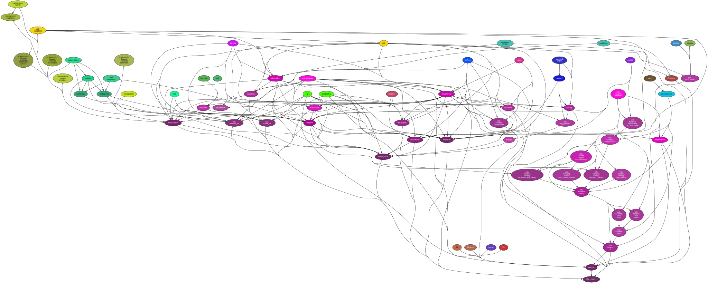
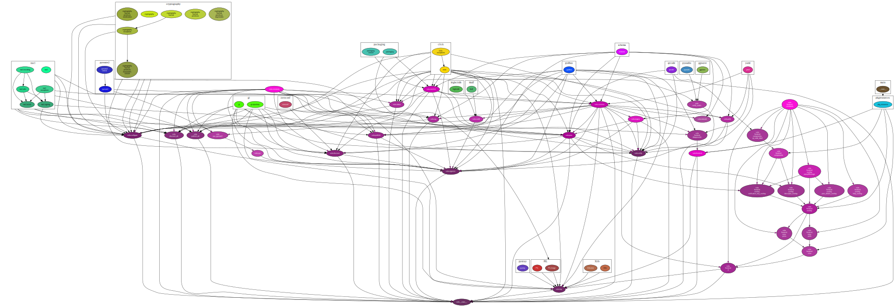
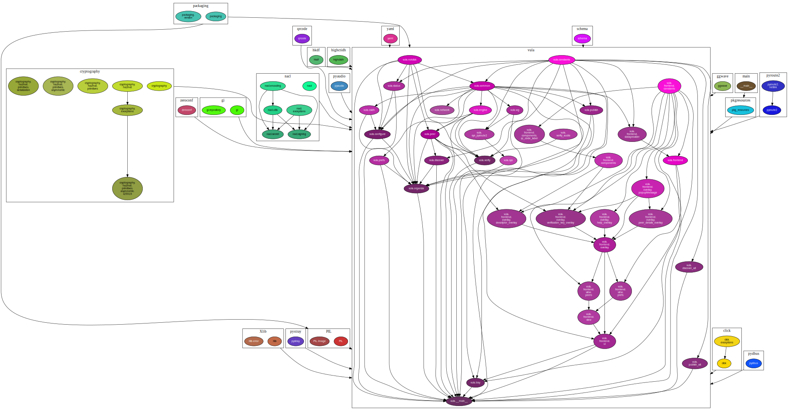

# Dependency Analysis

In order to easily visualize/list the python dependencies and relationships of
Vula, a few diagrams can be generated with the Makefile goal `deps-graph`:

```
make deps-graphs
```

The following diagrams will be generated:


All modules whether external or internal are all mixed up and linked to one
another.


This graph is clustering all the modules of the external dependencies, showing
which specific module of Vula is using which external dependency.


To further simplify the view, everything is clustered separately which reveals
how Vula is internally organized.

To analyse these dependencies relationships in a text format, consider running
the Makefile goal locally, which will allow you to generate the file
`vula_deps.json` in the folder `contrib/deps-graphs`. It is not directly included
in the repository as it contains host specific information (ie. system
specific paths).
