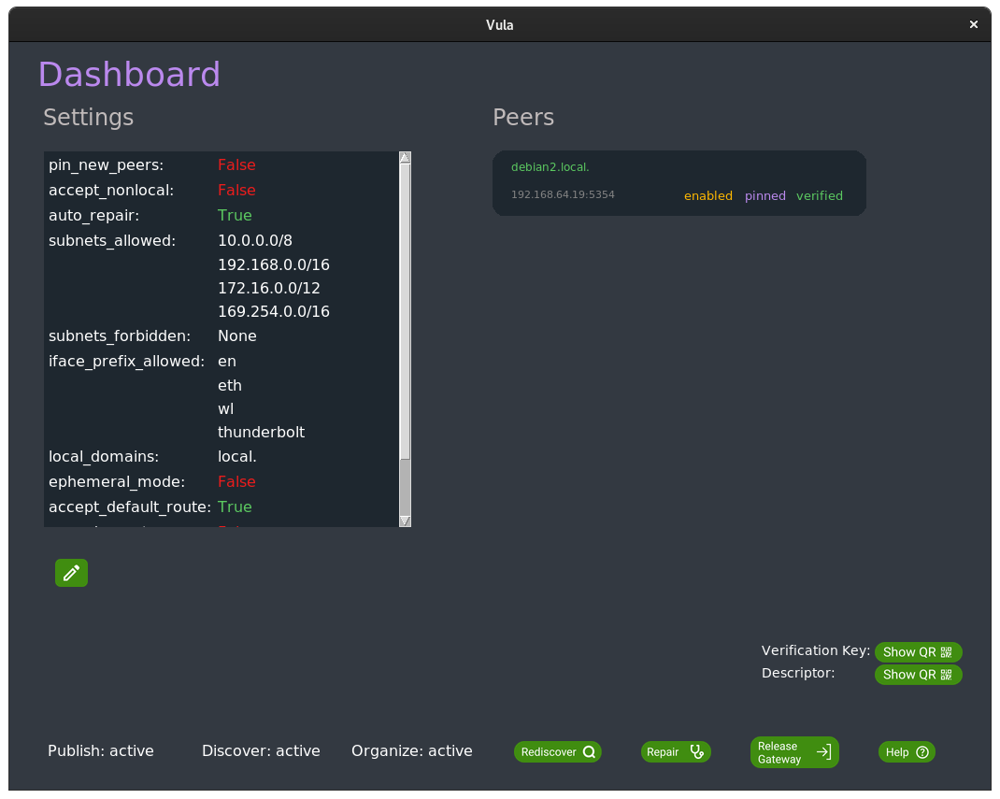
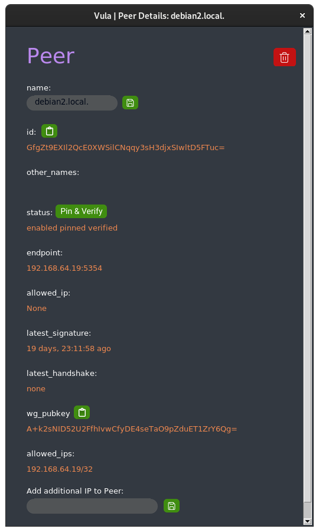
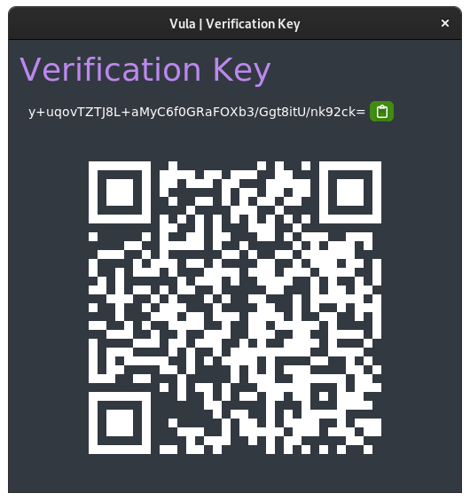
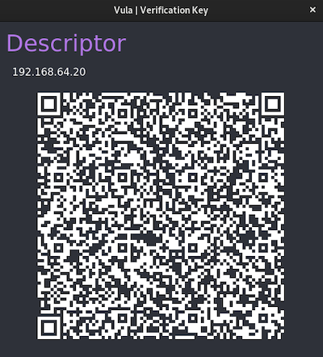

# Vula's TKInter GUI
The GUI was written using the Python interface **Tkinter** (standard Python interface to the Tcl/Tk GUI toolkit).

The initial Design was created with Tkinter Designer [0]. With Tkinter designer, one is able to design a Gui in Figma [1] and convert it to Tkinter Code.
Tkinter Designer is licensed under the "BSD 3-Clause License"[2].
Everything created (User-Content) using Figmas Services and the resulting Applications, are owned by the creator of the content. See Figma ToS Chapter 3.6 [3]

# Accessibility
Each element that is distinguishable by colour is also distinguishable by the corresponding text. Unfortunately, Tkinter does not create the necessary outputs for the common screen readers and is therefore not suitable for blind people. [4] [5]

# Testing
Testing tkinter Applications is not an easy task. Neither unit test nor doctest can be used to effectively test frontend Code. Those tests are more suitable for isolated helper methods without many side effects.
The most appropriate testing strategy would probably be functional testing with integration tests. That could be a project in the future.

# Localization
Currently the UI is not localized. There are some translations in `vula/locale`. But those are not used and do not work.
Because the buttons are implemented using images to achieve a better design the localization there is tricky.
Either we create a button for each language or we use normal buttons for buttons with text. Those buttons with only an icon are not a problem. 
Implementing localization and addressing this issue with the buttons would be a good follow-up project.

# Screenshots
## Dashboard

## Peer

## Verification Key

## Descriptor

### Sources
[0] [Github Tkinter-Designer](https://github.com/ParthJadhav/Tkinter-Designer)

[1] [Figma](https://www.figma.com)

[2] [BSD-3-Clause](https://directory.fsf.org/wiki/License:BSD-3-Clause)

[3] [Figma ToS](https://www.figma.com/tos/)

[4] [Tkinter Screen Reader Python Mail](https://mail.python.org/pipermail/tkinter-discuss/2013-September/003480.html)

[5] [Tkinter Screen Reader Forum Discussion](https://nvda-addons.groups.io/g/nvda-addons/topic/how_can_i_use_tkinter_to_set/10784805?p=,,,20,0,0,0::recentpostdate/sticky,,,20,2,0,10784805)