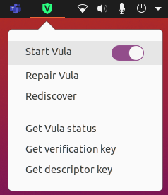

# VULA Gnome Shell extension



## Prerequisites

This extension was developed tested on GNOME 41 and is currently not compatible
with GNOME 42.

```
sudo apt install gnome-tweaks gnome-shell-extensions  
```

## Installation

```
# Clone project
sudo mv vula@bfh.ch /usr/share/gnome-shell/extensions
# Refresh gnome with "ALT+F2" and command "r"
```
Enable it under the Extensions to see it:


## Uninstallation

```
sudo rm -r /usr/share/gnome-shell/extensions/vula@bfh
# Refresh gnome with "ALT+F2" and command "r"
```

## Debugging

#### Accessing the logs
```
journalctl /usr/bin/gnome-shell -f -o cat
```
or
```
journalctl /usr/bin/gnome-session -f -o cat
```

## Useful links
https://www.codeproject.com/Articles/5271677/How-to-Create-A-GNOME-Extension
https://wiki.gnome.org/Projects/GnomeShell/Extensions/EcoDoc/Applet
