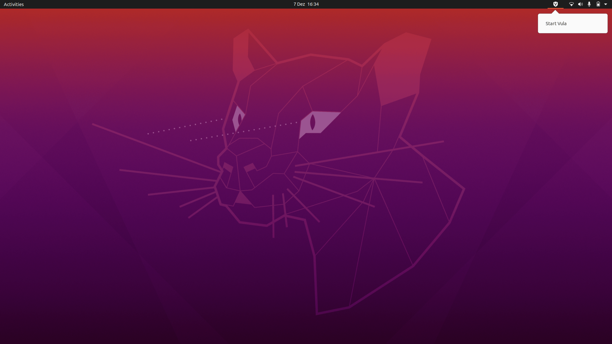
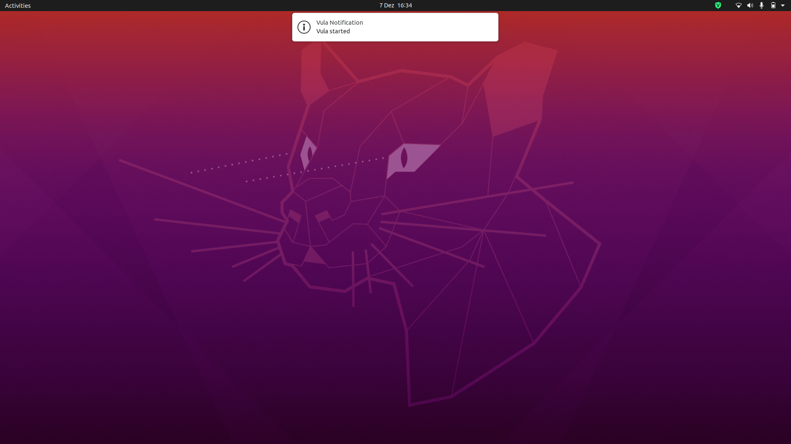
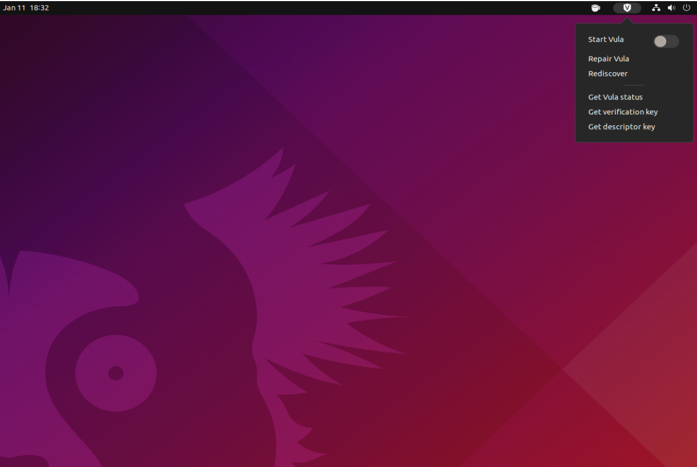
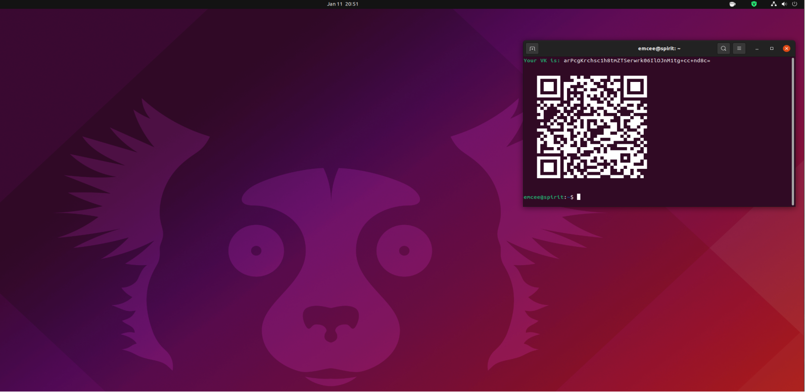
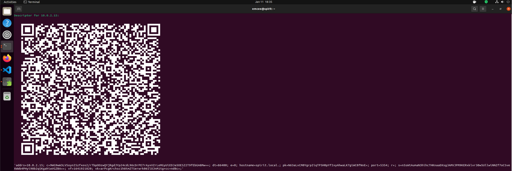

# Workjournal

## Step 1 - Vula Installation, Requirements Engineering, Design

### Goals
- Getting Vula to work on all teammembers environments
- Gathering Ideas of what should be created

### Problems encountered
- It was difficult to get a grasp of what Vula is and how it works
- Finding a way to extend Vula or to call the functions from a graphical interface
### Outcome
- Vula is now working for most teammembers
- we are happy with our idea of creating an Gnome Shell extension

## Step 2 - Get Familiar With Gnome Shell Extensions
### Goals
- understanding what kind of Extensions exist
- defining pros and cons for different technologies we could use
- researching how other extensions have been implemented
### Problems encountered
- Gnome Shell not being on all Linux platforms(ex. Linux mint) So it had to be tested on a Ubuntu platform
### Outcome
- a first skeleton could be created which we can build upon to implement the next step

## Step 3 - Create Icon and First Mini-Extension 
### Goals
- Designing Vula Icon
- Implementing first activatable extension with Vula Icon 
- Vula Icon changes color on click
### Problems encountered
### Outcome
The outcome of our first experiments were successful
- A custom vula extension can be added.
- When clicked it activates vula and the symbol turns green
- once started a notification that vula has started is shown
- on clicking the extension again it is deactivated after confirming through authentication

## Step 4 - Extend Mini-Extension Functionality

### Goals
- Adding more Vula functionality to the extention:

  - vula discover
  - vula repair
  - Get Vula Status
  - Get Verification key
  - Get desctriptor key

### Problems encountered
- Realization that extensions can break after System updates
- Was not possible to display the verification and descriptor key QR codes in the extension view due to limitations of the imported modules
- Documentation was very lacking and without changing source code of the modules it wasn't possible
- so we simply opened the QR codes in a console

### Outcome
The outcome was very successful besides the problems with the imported modules:
- The new vula extension menu:

- calls vula repair on clicking "repair vula" option and shows result in notification
- calls vula Rediscover on clicking "Rediscover" option and shows result in notification
- calls vula status on clicking "Get Vula status"

- Console pop up after selecting the "Get verification" key option:

- Console pop up after selecting the "Get descriptor key" option:
  
