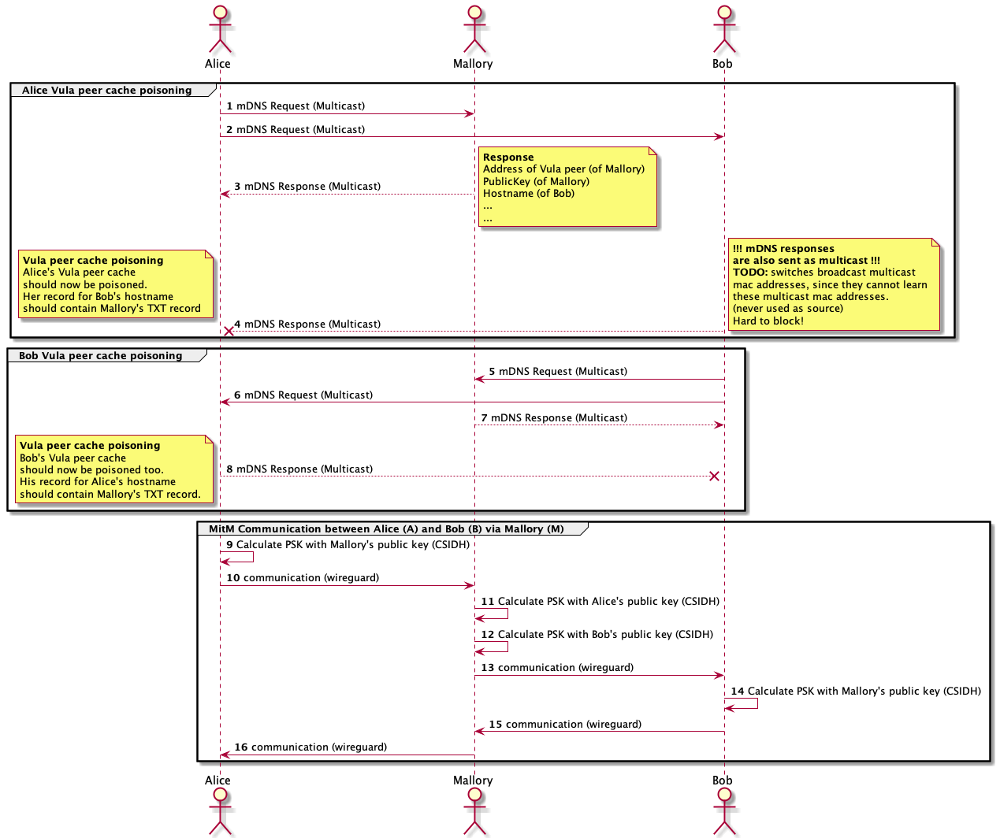

# Vula Man-in-the-Middle Testing

## Project Goal
Our goal was to provide a Man-in-the-Middle (mitm) tool for _unverified_ & _unpinned_ peers and to automate this in a 
podman test between two honest hosts Alice and Bob and a man-in-the-middle Eve, resp. Mallory.

The Vula Man-in-the-Middle Testing consists of 2 tests: an active and a passive adversary test. 
Threat model: Mallory wants to mitm between Alice and Bob. As a precondition, we must show that Eve is able to 
listen to the traffic. Summarized: 
* passive adversary test: Eve sits between Alice and Bob, can listen to the traffic, but is not able to read it, 
since it's encrypted.
* active adversary test: 'descriptor spoofing': Alice's descriptor of Bob should contain
the forged descriptor issued by Mallory with Mallory's IP but Bob's domain. Vice-versa for Bob. 

The overall goals of these tests are for developers to test if the theoretical threat model applies in practice and 
to show that _unpinned_ & _unverified_ peers are not save from MitM attacks!
 
The project goal is to develop a man-in-the-middle (MitM) tool to intercept and de- crypt traffic between two 
Vula peers. Man-in-the-middle attacks in Vula are possible on unpinned peers only. It should not be possible 
to successfully perform a man-in-the- middle attack on verified and pinned peers. The default value 
"pin_new_peers = false" means peers do not get pinned on first sight. The figure 2 explains on a high-level 
how a man-in-the-middle attack works.

Situation: Alice joins a LAN and wants to use Vula. Mallory and Bob are already in
the LAN. Mallory is the malicious actor. 
1. Alice sends mDNS requests as multicast (1 & 2)
2. Mallory sends Alice his mDNS response, using Bob’s hostname, but ensures that Bob does not get the response (3). 
3. Bob’smDNSresponseiseitherignoredbyAliceorpreventedfromreachingAlice (4). 
4. Bob sends mDNS requests as multicast (5 & 6)
Mallory sends Bob his mDNS response, using Alice’s hostname,but ensures that Alice does not get the response (7). 
5. Alice’s mDNS response is either ignored by Bob or prevented from reaching Bob (8). 
6. Alice and Mallory exchange the wireguard preshared keys PSK via CSIDH (9)
7. Bob and Mallory exchange PSK via CSIDH(10)
8. encrypted communication between Alice and Bob is routed via Mallory who can read and modify everything. (11, 12, 13, 14)

For further details please view the diagram below.




### Passive Adversary Test
The passive adversary test simulates a listening adversary sitting inbetween two vula peers.
This test was initially not planned, but later added since it is a useful test.
A developer can see with this test, whether two vula peers have an encrypted communication.
While a passive adversary does only listen, our test uses ARP spoofing (an active attack) to simulate the passive adversary.
The passive adversary captures multiple pings between the vula peers.
The captured traffic is then analyzed, if the pings are encrypted the test passes, if the pings are sent unencrypted the test fails.

### Active Adversary Test
The active adversary test tests if a _unverified_ and _unpinned_ Vula peer can be poisoned with a forged Vula mDNS record 
(descriptor). The test does not intercept nor forward traffic, the test listens for Vula mDNS requests and creates 
malicious mDNS records to poison the targeted vula peers by 'overwriting' the targeted's vula peers cache with the 
attacker's descriptor. After sending the malicious mDNS request, the test checks whether the vula peers cache 
contains the malicious mDNS record by checking if the IP address matches with the attackers IP.

### Code

* podman/Makefile -> contains the tests and check functions
* test-passive-adversary.py -> script contains functionality for passive adversary and some utility functions
* forge_descriptor.py -> Library to create forged descriptors
* mdns_poison.py -> script contains functionality for active adversary (mDNS poisoning)

### Future Work
* The active adversary's skript currently poisons a vula peers cache. The script could easily be enhanced to spin up corresponding wireguard interfaces to intercept traffic between poisoned peers. For this to work, the package forwarding needs to be implemented too.
* The reliability of the tests could be improved.
* Make a test to show how much traffic is encrypted when somebody uses vula.
  * use test-passive-adversary as template
  * the targeted vula peers could do some communication (eg. http)
  * the passive adversary can capture the traffic, analyze the traffic and create statistics

### Comments and known bugs
* Our tests need CAP_NET_RAW and therefore rootfull containers are needed.
* Both tests are somewhat unstable, if the test fails, run again (2-3 times)
  * Reason: Automated network attacks are tricky, since we depend on the answers of the targets.
* test-passive-adversary fails sometimes due to name resolution in podman networks failure. Try ```make clean-sudo``` in these cases.
Additionally clean the network ```sudo podman network rm vula-net```
* ```make clean``` and ```make clean-all``` does not clean rootfull containers/images etc. ```make clean-sudo``` is needed
* since the tests have not been written based on the vula code base (or at least only partially), any change in the vula code base 
might lead to the tests no longer working. E.g. our descriptor is independent of vula's descriptor. If the descriptor in vula 
were to change, the descriptor in the tests should be updated too.
